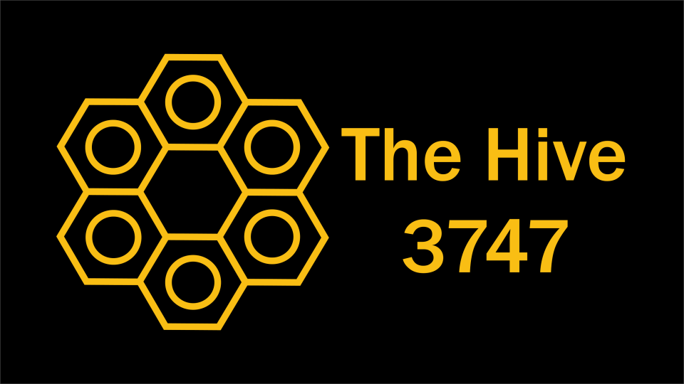

# Teaching AI Coding — FTC Robot in One Week

Materials for teaching FIRST Tech Challenge teams to write their robot code by describing it in plain language to Gemini in Android Studio, then testing and refining it one subsystem at a time.

At The Hive's robot-in-one-week, the students built and coded their robot the traditional way. The mentors entered the mentor competition with a robot of their own — and coded it entirely by describing it to Gemini in Android Studio. Ben, the coordinator, is a Java developer; he described the architecture on night one and typed no Java. After that the changes came from Asim and the mechanical mentors, who don't write Java: sometimes Asim at the keyboard himself, sometimes over the robot calling out the change while Ben typed. Timings, power levels, the park routine, a whole experimental autonomous: described in plain English. The code is in this repo verbatim, and so is every prompt from the week, with its author.

The experiment was the mentors'. The workshop is so that students can do the same. The mentor competition at the Robot in 7 Days Scrimmage is on the FIRST Robotics Utah stream, starting at 3:39:22: [youtube.com/live/E53OUghEmlg?t=13162](https://www.youtube.com/live/E53OUghEmlg?t=13162).

## What's here

| Folder | What it is | Audience |
|---|---|---|
| `slides/` | Kickoff deck (`kickoff.pptx`, import into Google Slides), its outline with speaker notes, and the script that builds it | Presenters |
| `guide/` | Step-by-step written guide, one file per checkpoint, plus [`the-loop.md`](guide/the-loop.md) (the method on one page) and [`receipts.md`](guide/receipts.md) (how to prove your students wrote it) | Teams following along |
| `video-scripts/` | Series plan and a script for each checkpoint video | Video production |
| `prompts/` | The real prompts from the build mapped to checkpoints, plus reconstructed ones where the team didn't follow the checkpoint order | Teams |
| `example-code/` | the mentor robot's final code verbatim (`final/`), and per-checkpoint snapshots derived from it | Teams (for comparison, not copying) |
| `docs/` | `verbatim-transcript.md` (every prompt, tagged by author, with Gemini's full replies), `code-history/` (the code after each of the 50 prompts that changed it), and Gemini's own summary | Everyone |

## The checkpoint sequence

Every deliverable follows the same order. Each checkpoint ends with a test on the real robot before moving on.

0. **Install** — Android Studio, the FtcRobotController project, sign in to Gemini
1. **Describe the robot** — hardware names, ports, purposes, directions, controls, sequences
2. **Mecanum drive** — tank + strafe TeleOp, test
3. **Intake** — collect and reject, test
4. **Shooter** — flywheel startup sequence and pulsed feed, test
5. **Refine** — the mechanical mentor's four real prompts
6. **Autonomous: back off the wall and shoot** — first state machine, test
7. **Autonomous: park** — Shoot First and Shoot Delayed, test
8. **Autonomous: under 30 seconds** — add it up, keep the LEAVE points, final test
9. **Extras** — LEDs, endgame rumble, the 4-ball experiment

## Why

**The problem every team has.** Most teams have one programmer, sometimes none. Every mechanical change waits on that one person: the programmer works while the mechanical teammate waits, then both watch the test. The mechanical people know what the robot should do — they just can't type it in Java. On The Hive's own robot this year, three students could code it, and they were siloed: one wrote TeleOp, one wrote autonomous, and when the robot crawled in testing the morning of the competition, the TeleOp programmer had to read the autonomous cold to find out why.

**It doesn't make the programmer go away. It makes them effective.** The programmer does the work nobody else can: describes the robot (every motor and servo, name, port, direction), architects it (subsystems, state machines, what the autonomous will need later), and sets the process (one change per prompt, test, commit). That groundwork is what lets a mechanical teammate make a change in English and have it land in the right place. Then the programmer reviews every change for drift — on the mentor robot, the autonomous that drove the intake through a simulated gamepad, and the D-pad that ended up doing two things instead of one; both worked, both were wrong, and only someone reading the code saw it. What the programmer gets back is the big picture: "what do I want vision to do?" instead of "how do I parse the Limelight result?" — and not 10–20 minutes of boilerplate every time an autonomous gains a state.

**The skeptics are half right, and the rule comes from that.** Hand a student an AI and a blank OpMode and they learn less: that's what the controlled studies show, and the harm tracks how the tool is used — delegate and auto-accept, you lose understanding; ask, read the diff, explain it, you don't. So The Hive's programmers hand-code 14 chapters of *Learn Java for FTC* and 40 simulator exercises, with AI forbidden, before they touch it. From the team's own training checklist: *"if you do not understand the basics of programming taught here, you will not be able to debug the code during the season. And, it becomes painfully obvious if you use AI because you cannot answer how your program works."* Fundamentals first, then AI — and you still explain the code, because at judging the students answer and adults may only observe.

**It's the next layer, not a shortcut.** Every generation of programming tools — compilers, Pascal, IDE autocomplete, Stack Overflow — was called "not real programming" by the one before. Each took over the typing; none took over the architecture, the testing, or the reading. This one doesn't either, and employers twenty minutes from here already write it into intern postings. The evidence, with its caveats, is in [`docs/research-ai-skills-case.md`](docs/research-ai-skills-case.md); the slides that carry it are in [`slides/`](slides/).

## Credits

- **Tom, Sophi and Sadiqah — The Hive's programmers** — hand-coded the team's own robot this season; present this workshop on stage and narrate the videos.
- **Ben** — coordinator; described the mentor robot's architecture to Gemini on night one and typed no Java.
- **Annie** — head coach.
- **Asim** — mechanical mentor; built the mentor robot and authored most of the later changes in plain English, at the keyboard for eight of them.
- **Royd** — second coach; mechanical engineer.
- **Claude** (Anthropic) — compiled the transcript, guide, slides and research from the team's material and direction.
- **Gemini in Android Studio** (Google) — wrote every line of the mentor robot's code from the mentors' descriptions, and its own summary of the week.

This workshop was made the way it teaches: described by the team, generated, tested, refined.

## Season note

This guide is written for the mentor robot from The Hive's 2026–27 (BIOBUZZ) robot-in-one-week, against FtcRobotController SDK v12.0: mecanum drive, one flywheel, intake with two rollers, goBILDA LEDs, time-based autonomous (no odometry). The prompting method carries over; the hardware details will not.
