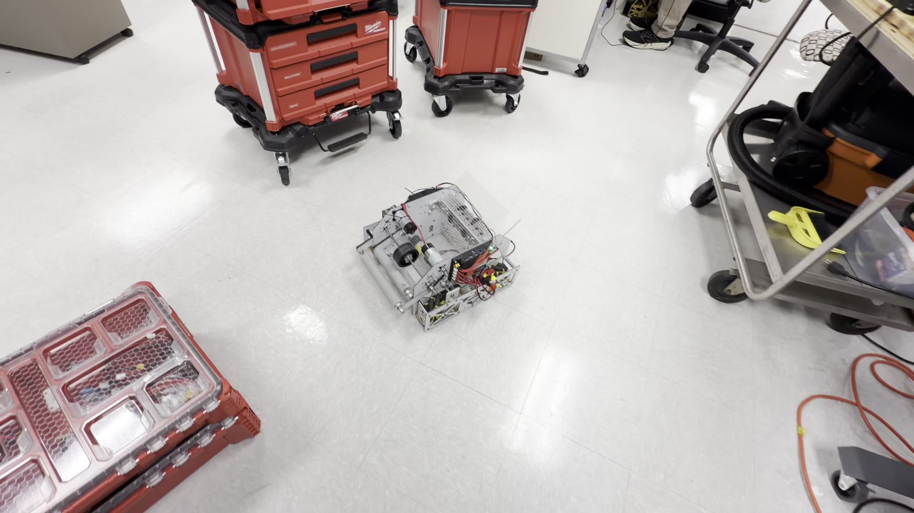

# Checkpoint 2 — Mecanum Drive

**At the end of this checkpoint:** A TeleOp OpMode that drives: tank-style on the two sticks, strafe on stick X, precision moves on the D-pad.

**Time:** 15–30 minutes including the test.

---

## 2.1 Ask for the drive, and only the drive

Same Gemini conversation as Checkpoint 1.

> **Prompt:**
>
> Create a TeleOp OpMode in the TeamCode module called `MecanumTeleOp`. For now, only the drive — no intake, no flywheel yet.
>
> - Use the iterative `OpMode` style (`init()` and `loop()`), not `LinearOpMode`.
> - Map the four drive motors by the names I gave you. Reverse `front_left_drive` and `back_left_drive`. Set all four to brake when power is zero.
> - Tank drive: left stick Y = left wheels, right stick Y = right wheels. Remember the stick Y axis is negative when pushed forward.
> - Strafe: average the two sticks' X values. Multiply by 1.1 to make up for mecanum strafe losses.
> - D-pad: up/down drive straight at 0.5, left/right strafe at 0.5, overriding the sticks while held.
> - Combine with standard mecanum mixing, normalize so no motor is asked for more than 1.0, then scale everything by 0.8.
> - Telemetry: show all four motor powers.
>
> Use the `@TeleOp` annotation so it shows up on the Driver Hub.

`[SCREENSHOT: Gemini panel with the prompt sent and the start of the generated OpMode visible]`

**Why iterative `OpMode`?** FIRST's samples use both styles. The mentors' build used `OpMode` (`init()`, `loop()`), which is a natural fit for state machines: `loop()` runs over and over, and each subsystem gets an `update()` call every time. Either works. Pick one and say which.

**Why tank drive?** Because a driver asked for it. The first build (Sep 17) was the usual POV layout — left stick moves, right stick turns. The next afternoon, verbatim:

> *hey, i prefer tank drive. can you set left joystick to controlling the left motors, right joystick to controlling the right motors, with y+ being forward on each side, y- being back, and both sticks pointing x- being strafe left, both sticks pointing x+ being strafe right?*

One prompt, and the drive the team used all week. Notice it defines every axis. The code it produced is [`docs/code-history/10-after-prompt-18/`](../docs/code-history/10-after-prompt-18/).

## 2.2 Read what it wrote

Open `TeamCode/src/main/java/org/firstinspires/ftc/teamcode/MecanumTeleOp.java`. You should be able to find these four things. Have the Reader point at each one:

1. **Hardware mapping** — in `init()`, lines like `frontLeftDrive = hardwareMap.get(DcMotor.class, "front_left_drive");`. Check the strings in quotes match your config exactly.
2. **Reversing** — `setDirection(DcMotor.Direction.REVERSE)` on the two left motors.
3. **Reading the gamepad** — in `loop()`: `gamepad1.left_stick_y`, `gamepad1.right_stick_y`, the two `_stick_x`, and the four `dpad_` checks.
4. **Setting power** — four `setPower(...)` calls after the mixing and the `* 0.8`.

If any of the four is missing, ask: "I don't see where you reverse the left motors. Add it."

**Compare with:** [`../example-code/02-mecanum-drive/MecanumTeleOp.java`](../example-code/02-mecanum-drive/MecanumTeleOp.java) — The Hive's final drive code with everything else stripped out. The real code at the moment tank drive went in (whole TeleOp, firewheels and LEDs included) is [`docs/code-history/10-after-prompt-18/`](../docs/code-history/10-after-prompt-18/).

## 2.3 Build and deploy

Click **Run ▶**. Wait for "Install successfully finished."

**If it won't build:**
- Red error in the bottom panel → select the whole error text, paste it into Gemini: *"This compile error came from the code you wrote. Fix it."* Deploy again.
- The most common one is `cannot find symbol` — Gemini used a class or method that doesn't exist in this SDK version. Pasting the error fixes it nearly every time.

## 2.4 Test

This is what a passing drive test looks like — the mentor robot on the shop floor, 17 seconds: [`docs/video/drive-test-shop-floor.mp4`](../docs/video/drive-test-shop-floor.mp4).

Robot on the floor, wheels free to move, nobody's feet nearby.

On the Driver Hub: select `Mecanum TeleOp` from the TeleOp list → **Init** → **▶**.

| Try | Expected | Write down what actually happened |
|---|---|---|
| Both sticks forward | Robot drives forward | |
| Both sticks back | Robot drives backward | |
| Left stick forward only | Robot curves right | |
| Both sticks pushed left (X) | Robot strafes left | |
| Both sticks pushed right (X) | Robot strafes right | |
| D-pad up | Creeps forward, slower | |
| D-pad left | Creeps left | |
| Release everything | Robot stops | |

`[SCREENSHOT: Driver Hub with Mecanum TeleOp selected, telemetry showing four motor powers]`

## 2.5 If it's wrong

Write down the symptom in words, then use the matching prompt. The first one is what actually happened on the mentor robot — and the prompt is the one the team typed:

| Symptom | Prompt |
|---|---|
| **Strafe is mirrored** | *"hey, in the latest push, holding both joysticks left made the robot strafe right, and vice versa. please fix"* — the real prompt. Gemini flipped the strafe signs in the four mixing lines. |
| Forward goes backward | "Both sticks forward drives the robot backward. The Y axis sign is wrong — negate it." |
| Robot spins in place on forward | Two motors are reversed wrong. "When I push both sticks forward, the robot spins. Re-check which motors are reversed; the left motors are on the left side of the robot." Then physically verify which motor is which. |
| One wheel doesn't move | Probably a config or cable problem, not code. Check the port on the hub and the name in the config. |
| Robot crashes on Init: *Unable to find a hardware device with name "X"* | Name mismatch. Compare the quoted string in the code to the config. Tell Gemini the correct name. |
| D-pad does nothing | "The D-pad precision moves aren't working. Show me where you read `gamepad1.dpad_up`." |
| Too fast to control | "Lower the drive cap from 0.8 to 0.6." |

Every fix is one prompt, one deploy, one test. Don't stack them.

Notice the real prompt: it names the *symptom* exactly ("holding both joysticks left made the robot strafe right") and says what's wanted ("please fix"). It doesn't guess at the cause. That was enough.

## 2.6 Save it

Once all eight rows in the test table pass: commit in Git (**Git → Commit**, message "Mecanum drive works") or copy `MecanumTeleOp.java` to a safe folder.

## Checkpoint 2 test

- [ ] All eight drive tests pass
- [ ] The Reader can point at the four parts of the code (mapping, reversing, gamepad, power) and say what each does
- [ ] Saved

Go to [Checkpoint 3 — Intake](03-intake.md).
