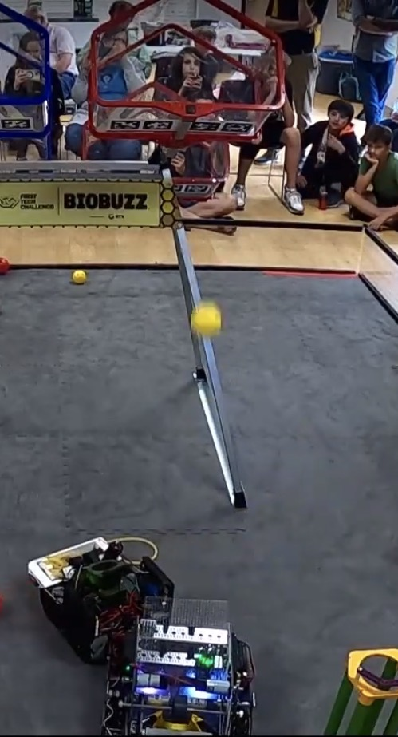

# Checkpoint 6 — Autonomous: Back Off the Wall and Shoot

**At the end of this checkpoint:** An autonomous OpMode that backs away from the wall to shooting distance, settles, spools the flywheel, pulse-shoots the preloaded balls, and stops. No parking yet.

**Time:** 30–45 minutes.

---

## 6.1 Autonomous without sensors



You don't need odometry or encoders to score in autonomous. Time-based driving ("backward at 0.3 power for 0.3 seconds") is repeatable enough for a first week, as long as the battery is charged and the wheels are clean.

The autonomous is a **state machine**: a list of steps, each with a condition for moving to the next. This is the mentor robot's:

```
  START
    │
    ▼
┌──────────────────────┐  all four motors at -0.3 for 0.30 s
│   STATE_1_BACK_UP    │  (robot starts against the wall; backs to shooting distance)
└──────────┬───────────┘
           ▼
┌──────────────────────┐  motors stopped, 1.0 s
│STATE_1B_SETTLE_1000MS│  (let the robot stop rocking before shooting)
└──────────┬───────────┘
           ▼
┌──────────────────────┐  flywheel straight to target power, 2.0 s
│ STATE_2_START_FLYWHEEL│ (NO reverse bump — balls are preloaded and it would spit them out)
└──────────┬───────────┘
           ▼
┌──────────────────────┐  "hold right bumper": intake pulses 100 on / 200 off
│ STATE_3_PULSE_SHOOTING│ for 10 s
└──────────┬───────────┘
           ▼
┌──────────────────────┐  flywheel and intake off
│ STATE_4_STOP_SHOOTING │
└──────────┬───────────┘
           ▼
┌──────────────────────┐  everything off, stay here
│   STATE_6_ALL_STOP   │
└──────────────────────┘
```

Each box is a state. Each arrow is "when the timer passes N seconds, go to the next state." That's all a state machine is.

This is how the mentors asked for their first autonomous, verbatim (Sep 18, ~9:50 PM) — notice it's already a numbered state machine with exit conditions, and it ends with a question:

> *I need you to write two autonomous opmodes.  We have a competition in which one robot shoots first and then causes a bistable "hive" target to tip to the other side. So one robot shoots while the other waits. Then the other robot shoots. I would like our second opmode to wait 15 seconds before shooting.*
>
> *Here is the state machine:*
> *start ->*
> *1. flywheel starts moving - exit to state 2 by 1 second passing ->*
> *2. start shooing by using our teleop procedure of pulsing the intake - exit to state 3 by 10 seconds passing ->*
> *3. stop shooting and turn off intake and flywheel - exit to state 4 directly ->*
> *4. drive backwards away from the wall slowly at 0.4 power (our shooter is on our back, intake on front) - exit to state 5 after one second*
> *5. all stop -> end state machine*
>
> *Note that both autonomous sysems do the same thing. But the second autonomous waits 15 seconds.*
>
> *Any questions or problems you see?*

The two details that make the final version different from this first one both came from testing, and both are verbatim:

- **No reverse bump in auto.** *"The robot spit out the balls in experimental. Let's not reverse the intake before we shoot the first balls. It is preloaded and we have placed them correctly."* → `startDirect()`.
- **Settle before shooting.** *"Let's give the robot 500ms to settle after driving backwards. the inertia is causing the balls to shoot too quickly."* then, one test later, *"This is better. We need a full second of settling time."*

Both are in the prompt below, so you don't have to find them the same way.

## 6.2 Reuse the subsystems — by calling them

The autonomous drives the flywheel and intake through the same `Flywheel` and `Intake` classes TeleOp uses, by calling their methods directly: `flywheel.startDirect()`, `intake.setFeed(true)`, `intake.stop()`. That's the payoff of the "an autonomous will use this later" line in Checkpoints 3 and 4: the pulse timing, the phase logic, everything you tuned in Checkpoint 5 comes along for free, and the auto never touches a button name.

### What the mentors' code actually does — and why we don't teach it

Look at [`example-code/final/BaseAuto.java`](../example-code/final/BaseAuto.java). It doesn't call `intake.setFeed(true)`. It creates a **simulated gamepad** — `autoGamepad = new Gamepad()`, a controller nobody is holding — and sets `autoGamepad.right_bumper = true` when it wants to feed, then passes that object to the same `update()` TeleOp uses. The subsystems can't tell the difference. It works, and it shipped.

It's also a shortcut. The autonomous now depends on the TeleOp *button mapping*: move feeding from RB to a trigger and the auto silently stops feeding. It was one refactor the team didn't get to. And it happened for a reason worth remembering: **nobody told Gemini, when it wrote `Intake` and `Flywheel`, that an autonomous would need them.** With only a TeleOp in view, the fastest route from "feed when RB is held" to working code is to put the behavior behind the gamepad — so that's what it built, and when the auto came, faking a gamepad was the fastest route again.

Gemini will make it work. It won't always make it work the way you'd choose, and it takes the most expedient route unless you tell it what's coming. That's why the Checkpoint 3 and 4 prompts in this guide say "an autonomous will use this class later." Say what the code will be used for, not just what it does now.

## 6.3 Ask for it

Start a **new** Gemini conversation for the autonomous, and paste your robot description from Checkpoint 1 first. Then:

> **Prompt:**
>
> Create an Autonomous OpMode in TeamCode called `AutoShootFirst`, iterative `OpMode` style like `MecanumTeleOp`. Annotate it `@Autonomous(name = "Auto: Shoot First")`. Same four drive motors, same reversals and brake settings as `MecanumTeleOp` — read them from that file. Reuse the existing `Flywheel` and `Intake` classes; don't modify them.
>
> The robot starts with the shooter facing the goal and its back against the wall. Preloaded balls are already in the intake.
>
> Implement a state machine with an enum and `ElapsedTime`:
>
> 1. `STATE_1_BACK_UP` — all four drive motors at −0.3 for 0.30 seconds, to back away from the wall to shooting distance.
> 2. `STATE_1B_SETTLE_1000MS` — drive motors at 0 for 1.0 second so the robot stops rocking.
> 3. `STATE_2_START_FLYWHEEL` — add a `startDirect()` method to `Flywheel` that goes straight to RUNNING at target power, skipping the reverse bump (balls are preloaded; reversing would eject them). Call it, and wait 2.0 seconds.
> 4. `STATE_3_PULSE_SHOOTING` — call `intake.setFeed(true)` so the intake pulses exactly as in TeleOp. Stay here 10 seconds. On exit, `intake.setFeed(false)`.
> 5. `STATE_4_STOP_SHOOTING` — `flywheel.stop()`, `intake.stop()`.
> 6. `STATE_6_ALL_STOP` — everything at zero. Stay here.
>
> Reset the state timer on every transition. Don't use the gamepad `update()` methods or a fake `Gamepad` — call the subsystem methods directly. If the subsystems need a per-loop tick to run their timers, add a `tick()` method that does that without a gamepad, and call it every loop after the switch. Show the current state, state time, total time, and flywheel phase on telemetry. No `sleep()`.

`[SCREENSHOT: Gemini panel showing the generated state machine with the enum and switch visible]`

(The state numbering with a gap — no STATE_5 — is the mentors'. STATE_5 is the park sequence, added in Checkpoint 7. Leaving the gap now means the names won't shift later.)

## 6.4 Read what it wrote

Find:
1. `enum AutoState { STATE_1_BACK_UP, STATE_1B_SETTLE_1000MS, STATE_2_START_FLYWHEEL, STATE_3_PULSE_SHOOTING, STATE_4_STOP_SHOOTING, STATE_6_ALL_STOP }`.
2. A `switch (currentState)` inside `loop()`, with a `case` for each state.
3. In each case, a check like `if (stateTime >= 0.30) { currentState = AutoState.STATE_1B_SETTLE_1000MS; stateTimer.reset(); }`.
4. `intake.setFeed(true)` inside STATE_3 and `intake.setFeed(false)` (or `intake.stop()`) on the way out — and **no** `Gamepad` object anywhere in the file. If Gemini made one anyway, say: "Don't simulate a gamepad. Call `intake.setFeed` directly."
5. The new `startDirect()` in `Flywheel.java`.

Ask the Reader: "How does the robot get from BACK_UP to SETTLE?" The answer is the timer check. If they can say that, they understand state machines.

**Compare with:** [`../example-code/06-auto-shoot/`](../example-code/06-auto-shoot/) — derived from the mentor robot's `BaseAuto.java` with the delay, park, and LEDs removed.

## 6.5 Test

**Setup:** Robot against the wall in its starting position, balls preloaded, field clear.

On the Driver Hub: `Auto: Shoot First` from the Autonomous list → Init → ▶.

Watch and write down:

| Step | Expected | Actual |
|---|---|---|
| Backs off the wall | Short backward move, stops | |
| Settles | A full second of nothing | |
| Spools | Flywheel audibly at speed before feeding starts; telemetry says RUNNING | |
| Shoots | Balls launch one per pulse; all preloaded balls gone well before 10 s is up | |
| Done | Everything stops | |
| Total time | About 13.3 s | |

Run it **three times**. Time-based auto varies; you want to see the variation.

## 6.6 If it's wrong

| Symptom | Prompt |
|---|---|
| Drives *toward* the wall | "STATE_1_BACK_UP is driving the wrong way. The robot starts with its back to the wall and should move away from it — negate the drive power." |
| Backs off too far / not far enough | "Change STATE_1_BACK_UP from 0.30 to 0.40 seconds." (or down) One change per run. |
| First shot wild | Settle too short, or it's rocking. "Increase the settle from 1.0 to 1.5 seconds." |
| A ball pops out the front when the flywheel starts | The reverse bump ran. "STATE_2 must call `startDirect()`, not the normal startup — it's running the reverse bump." |
| Balls dribble | "Increase STATE_2_START_FLYWHEEL from 2.0 to 2.5 seconds." Or the target is low — check `Flywheel`'s default. |
| Doesn't feed | The feed pulse timer isn't being ticked. "In STATE_3 `setFeed(true)` is called but the intake never pulses. Show me where the pulse timer runs each loop when there's no gamepad." |
| Never reaches ALL_STOP | "STATE_3 never exits. After 10 seconds move to STATE_4_STOP_SHOOTING." |
| Shooting takes forever with balls gone | "Reduce STATE_3_PULSE_SHOOTING from 10 to 6 seconds." (Careful: Checkpoint 8 is where you tune this against the 30-second limit.) |

Keep the tuning table:

| BACK_UP (s) | Power | SETTLE (s) | SPOOL (s) | SHOOT (s) | Result |
|---|---|---|---|---|---|
| 0.30 | −0.3 | 1.0 | 2.0 | 10.0 | |
| | | | | | |

## 6.7 Save it

Commit: "Auto shoots from the wall."

## Checkpoint 6 test

- [ ] Three runs in a row: backs off, settles, spools, launches all preloaded balls, stops
- [ ] Reader can explain how the state machine moves between states, and why the auto calls `intake.setFeed` instead of pretending to press a button
- [ ] Tuning numbers written down
- [ ] Saved

Go to [Checkpoint 7 — Autonomous: park](07-auto-park.md).
